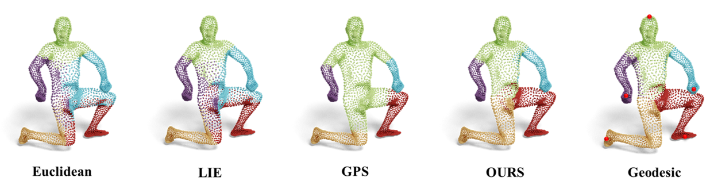

# Neural-Intrinsic-Embedding

This repository is a PyTorch implementation of [Neural-Intrinsic-Embedding](https://openaccess.thecvf.com/content/CVPR2023/papers/Jiang_Neural_Intrinsic_Embedding_for_Non-Rigid_Point_Cloud_Matching_CVPR_2023_paper.pdf).




### Requirements

To install requirements:

```setup
pip install -r requirements.txt
```
Installing PyTorch may require an ad hoc procedure, depending on your computer settings.

### Data & Pretrained models
You can find the data and the pre-trained models in:
```
data
models
```


### Evaluation

To evaluate the model  FAUST\SCAPE, run:

```eval
python code/faust/test_faust_sample.py
or
python code/scape/test_scape_sample.py
```
And in matlab the script:
```eval
code/eval/FAUST_5k.m
or 
code/eval/SCAPE_5k.m
```

### Training

First, you should compute the geodesic distance matrix for each shape in the dataset. You can use the code in [this repository](https://github.com/nmwsharp/potpourri3d?tab=readme-ov-file#mesh-geodesic-paths) and put them in:

```
data/{DATASET_NAME}/geod
For example:
data/SCAPE_5k/geod/mesh000.npy  
```
if mesh000 has N points, then the distance matrix mesh000.npy has the shpae of [N,N].


To train the basis model, you may run:
```
python code/train_basis_sample.py --config config/train_scape_5k.yaml
```


Thenn, to train the descriptor model, you may run:
```
python code/train_desc_sample.py --config config/train_scape_5k.yaml 
```


### License
[](https://creativecommons.org/licenses/by-nc/4.0/)

If you use this code, please cite our paper.

```
@inproceedings{jiang2023neural,
  title={Neural Intrinsic Embedding for Non-rigid Point Cloud Matching},
  author={Jiang, Puhua and Sun, Mingze and Huang, Ruqi},
  booktitle={Proceedings of the IEEE/CVF Conference on Computer Vision and Pattern Recognition},
  pages={21835--21845},
  year={2023}
}
```

This work is licensed under a [Creative Commons Attribution-NonCommercial 4.0 International License](http://creativecommons.org/licenses/by-nc/4.0/). 
For any commercial uses or derivatives, please contact us.